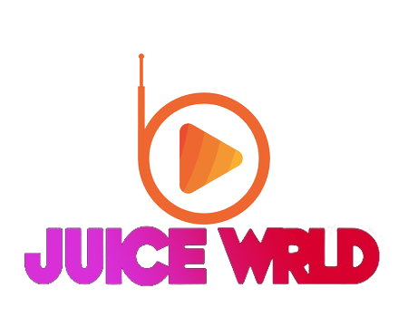

# JuiceWRLD Radio



Welcome to JuiceWRLD Radio, your one-stop destination for enjoying the music of the late great Juice WRLD! This web application is designed to let you dive deep into the world of Juice WRLD's music. Whether you want to sing along with the lyrics, find your favorite tracks, or discover something new, we've got you covered.

## Features

### Lyrics
Dive into the poetic lyrics of Juice WRLD's songs. Our application fetches lyrics in real-time, allowing you to follow along with Juice WRLD's words as you listen to his music. Feel the emotions behind his lyrics as you connect with his music on a whole new level.

### Search Songs
Looking for a specific Juice WRLD track? Our search feature makes it easy to find any song in his extensive discography. Simply type in the song's name, and we'll locate it for you, so you can start listening without delay.

### Random Song Selection
Feeling adventurous? Let JuiceWRLD Radio take the wheel and surprise you with a random selection from Juice WRLD's vast catalog. It's a great way to rediscover forgotten gems or explore tracks you may have missed.

## Getting Started
1. Clone this repository to your local machine. 
   ```bash
   git clone https://github.com/willfourtwenty-Projects/JuiceWRLD-RADIO.git 
   ```

2. Open the `index.php` file in your preferred web browser.

3. Start enjoying Juice WRLD's music!

## Technologies Used
- PHP
- HACK (backend, not included in this repository)
- HTML/CSS for the frontend
 

## Acknowledgments
- Special thanks to Juice WRLD for his incredible music and inspiration.
- Thanks to the open-source community for their contributions to the technologies used in this project.

## Contact
If you have any questions, suggestions, or just want to chat about Juice WRLD's music, feel free to reach out to us at juicewrldradio@example.com.

Enjoy your journey through the world of Juice WRLD's music with JuiceWRLD Radio! 🎵🖤
